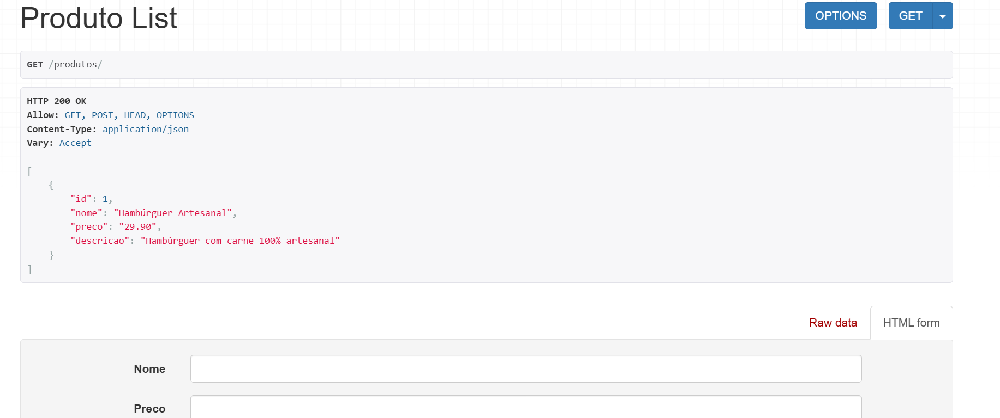

📦 API de Produtos – Desafio Back-end (Python + Django REST)

Este projeto foi desenvolvido como parte do desafio técnico da vaga de Estágio em Desenvolvimento – Back-end API da empresa Infinix Tecnologia e Assessoria LTDA.

A aplicação consiste em uma API simples para listagem, criação e visualização de produtos, utilizando Django REST Framework.

🚀 Tecnologias Utilizadas
Python 3
Django 5
Django REST Framework
SQLite3

📌 Funcionalidades da API

➡ A API permite:
✨Listar produtos
   GET /produtos/
✨Criar novos produtos
   POST /produtos/
✨Acessar detalhes de um produto
   GET /produtos/<id>/

🗂 Estrutura do Projeto
api-produtos/
│── core/              # Configurações principais do projeto
│── produtos/          # App responsável pela API de produtos
│── venv/              # Ambiente virtual
│── db.sqlite3         # Banco de dados
│── manage.py          # Comandos do Django
│── requirements.txt   # Dependências do projeto

⚙️ Como rodar o projeto

1️⃣ Clone o repositório
git clone https://github.com/JonathasTrevezani/api-produtos.git

2️⃣ Entre na pasta do projeto
cd api-produtos

3️⃣ Crie e ative o ambiente virtual (opcional, mas recomendado)
Windows:
python -m venv venv
venv\Scripts\activate

4️⃣ Instale as dependências
pip install -r requirements.txt

5️⃣ Rode as migrações
python manage.py migrate

6️⃣ Inicie o servidor
python manage.py runserver

A API ficará disponível em:

👉 http://127.0.0.1:8000/produtos/

🖼️ Prints da API funcionando 

 Autor

Jonathas Trevezani  
Estudante de Técnico em Desenvolvimento de Sistemas – SENAI  
Aspirante a Desenvolvedor Back-end Python/Django  

📧 E-mail: joni.rj@hotmail.com  
🔗 LinkedIn: https://www.linkedin.com/in/jonathas-trevezani-16959853/  
🐙 GitHub: https://github.com/JonathasTrevezani  
🎥 Pretendo publicar um vídeo no LinkedIn mostrando a API funcionando.   